# Welcome to The 50:30:20 Budget Manager

Simplify Your Budgeting with the 50/30/20 Rule
Easily manage your finances by categorizing your expenses into three simple categories: Needs, Wants, and Savings/Debt.

link to Live site - https://budgetmanager-50-30-20-82c8070c76df.herokuapp.com/

## Problem Statement
Managing personal finances effectively can be challenging without a clear budgeting framework. Many individuals struggle to balance essential expenses, discretionary spending, and long-term savings, leading to financial stress. There is a need for a simple tool that helps users allocate their income efficiently.

## Purpose
The 50:30:20 Budget Manager app aims to provide a straightforward tool for managing personal finances using the 50:30:20 rule. It helps users allocate 50% of their income to essentials, 30% to discretionary spending, and 20% to future savings, promoting financial stability, reducing stress, and promoting intentional spending.

## Target Audience
- Young professionals
- College students
- Families
- Individuals seeking financial improvement
- Personal finance enthusiasts

## Features
- User Authentication (Registration, Log In)
- Income and Expense Tracking
- Budget Allocation (50:30:20)
- Clean, intuitive interface
- Basic Settings and Customization
- Filter by week, month, or year

## Additional Features
- Piechart Visualization
- Bar Chart for expenses
- Connection to different bank accounts

## User Stories
### User Authentication
- As a user, I want to create an account so that I can securely access my budget data.
- As a user, I want to log in so that I can access my existing budget information.
- As a user, I want to log out so that I can ensure my budget data is secure.

### Income and Expense Tracking
- As a user, I want to input my monthly income so that I can track my total available funds.
- As a user, I want to add an expense so that I can keep track of my spending.
- As a user, I want to categorize my expenses so that I can see how my spending aligns with the 50:30:20 rule.

### Budget Allocation
- As a user, I want the app to automatically allocate my income based on the 50:30:20 rule so that I can easily follow a balanced budget.
- As a user, I want to see a summary of my allocated budget so that I know how much I should spend in each category.

### Visual Budget Overview
- As a user, I want to see a pie chart of my budget allocation so that I can visually understand how my income is distributed.
- As a user, I want to see a bar chart comparing my actual expenses to my budget so that I can quickly identify overspending or underspending.

### Basic Reporting and Insights
- As a user, I want to see a monthly summary of my income and expenses so that I can review my financial activity for the month.
- As a user, I want to compare my actual spending to my budgeted amounts so that I can assess my adherence to the 50:30:20 rule.

### User Interface
- As a user, I want to input my monthly income so that I can track my total available funds.
- As a user, I want to add an expense so that I can keep track of my spending.
- As a user, I want to categorize my expenses so that I can see how my spending aligns with the 50:30:20 rule.

### Basic Settings and Customization
- As a user, I want to update my profile information so that my account details are current.
- As a user, I want to adjust my income so that my budget reflects any changes in my earnings.

## Database Structure
Basic Data Model 

Data Model (with planned/received amount, Planned/spent amount, target amount/current amount ) 

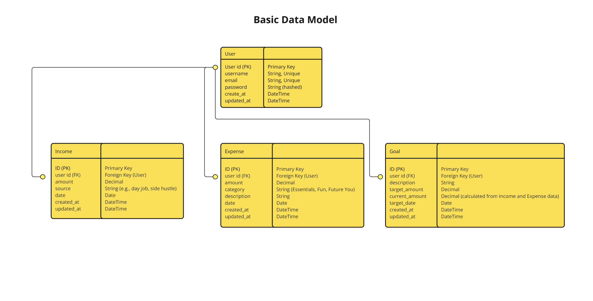

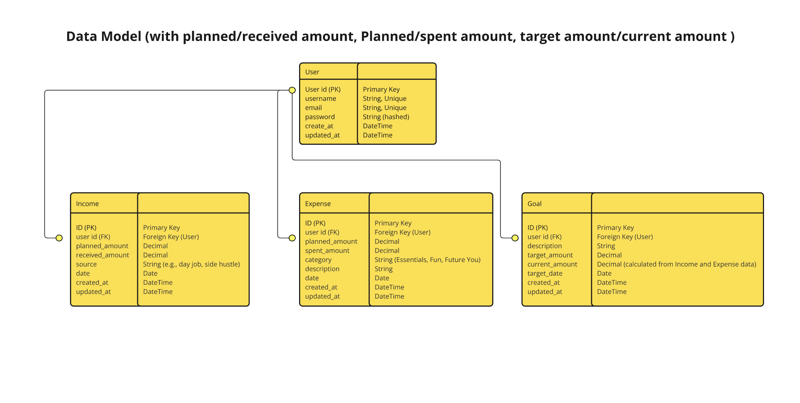

## Competitor Research
(Include your competitor research screenshots and descriptions here)

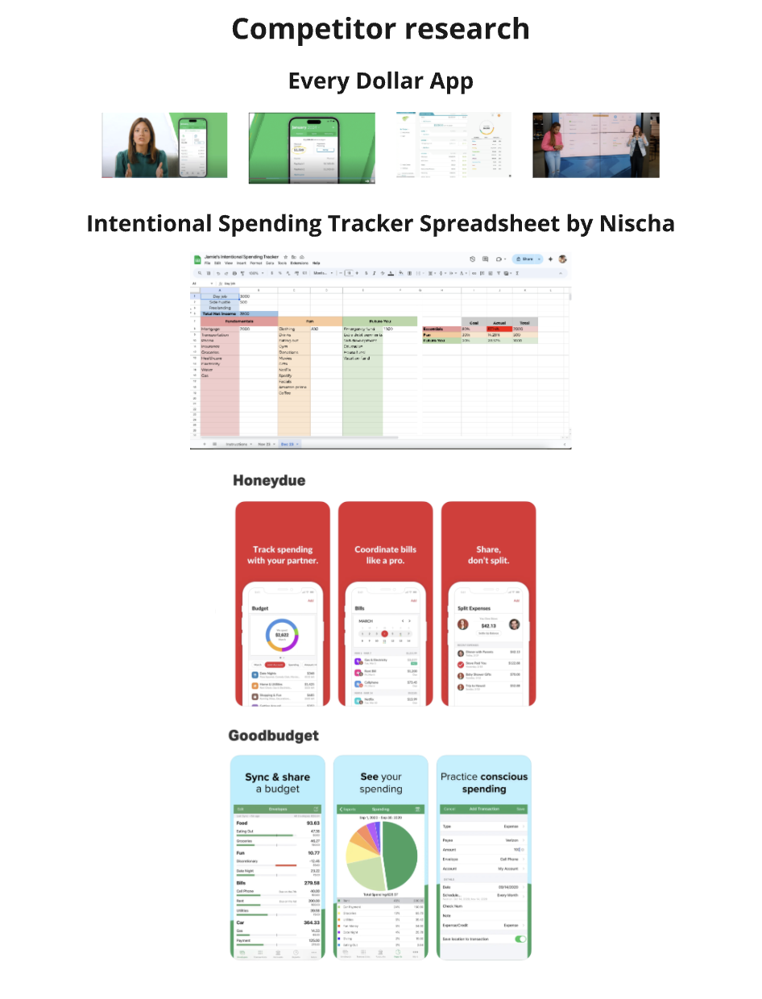

## User Flow 

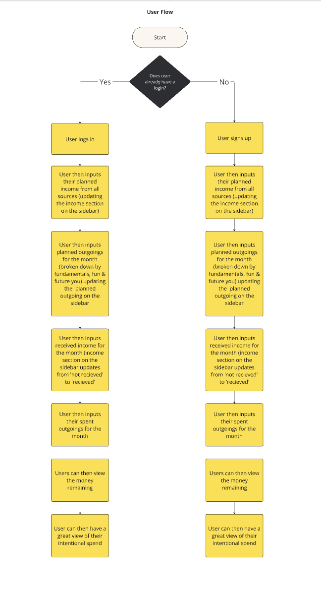

## User Experience / Wireframes

Login / Sign up 

)

.png)

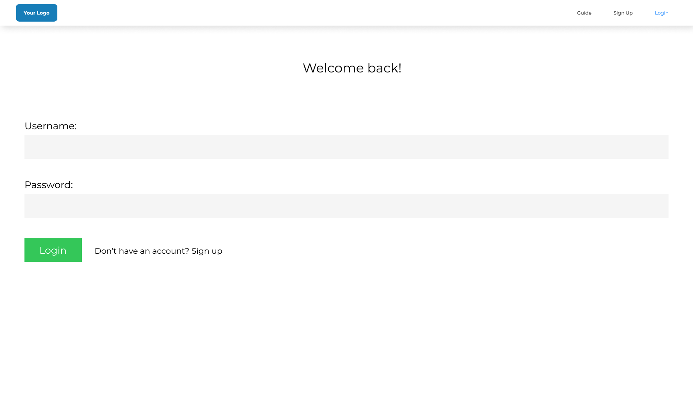

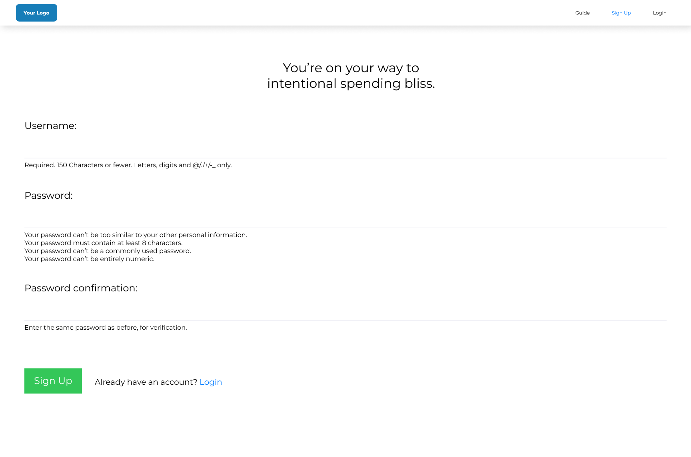

Desktop 

Planned tab
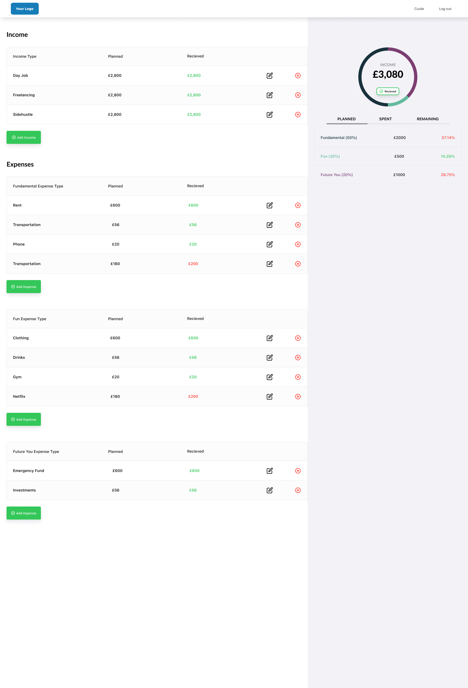

Spent Tab 
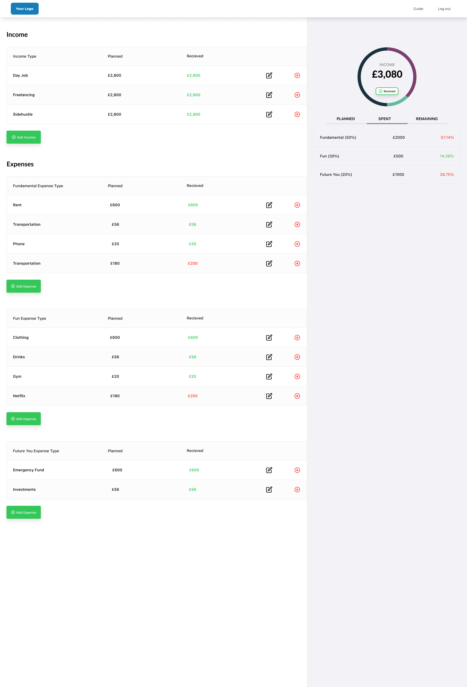

Remaing Tab
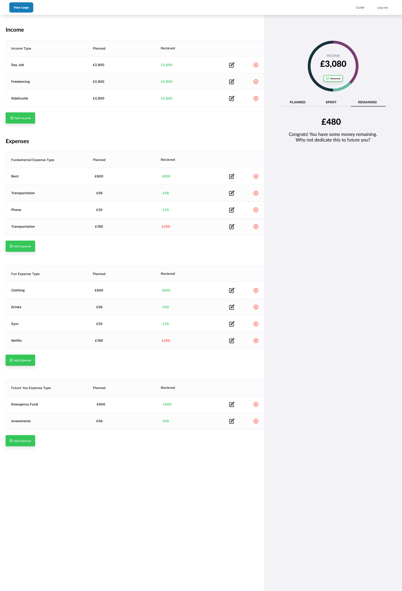

Mobile

Planned tab

Spent Tab 
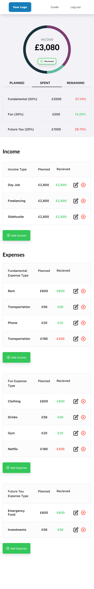

Remaing Tab
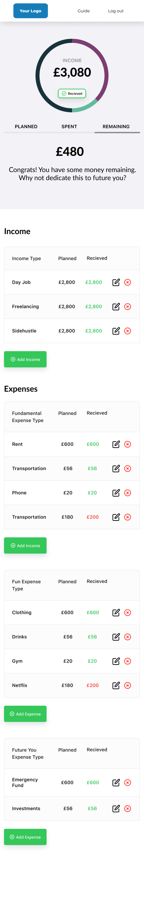

## Agile Methodology

When developing this app an agile approach has been taken throughout this project. I adapted and agile methodology to ensure an efficient and continual progress was being made. I broke each instance down into smaller user stories so they were refined into more manageable tasks therefore each user story has different acceptance criterias. The link to the kanban board for the User Stories can be found [here](https://github.com/users/JPudsey-11/projects/4/views/1).

## Agile Methodology

By utilising the MoSCoW prioritisation method in this project I was able to categorise my tasks into:

# Must Haves

- User Authentication (Registration, Log In)
- Income and expense tracking ( Income Input, Expense Categorisation, Expense input)
- Budget Allocation (50:30:20 / Shows you the goal 50:30:20 / The actual amount (% & £) for that month.
- Clean, intuitive interface

# Should Haves

- Piechart Visualisation
- Basic Settings and customisation.

# Could Haves

- Bar Chart for expenses
- Connection to different bank accounts
- Filter by week, month or year.

## Kanban Board
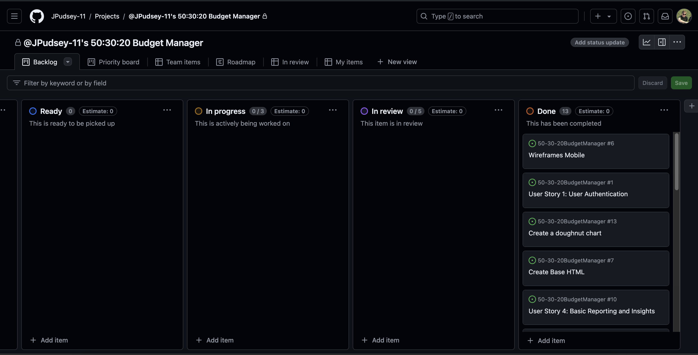

The Kanban Board provided a visual overview of the project's progress and facilitated efficient task management. It was organised into the following sections:
- Todo: This section contained all the tasks that needed to be done for the project to be completed and done.
- In Progress: The in progress section indicated active tasks that were being worked on.
- Done: The done section are the tasks that were completed successfully.

## User Stories 

User stories played a vital role in the development process, it helped ensure the features were inline with the users needs, all of the user needs were written out onto the kanban project board, which helped guide tasks being implemented and what to prioritse.

## Task Management

In addition to tracking user stories, the kanban board functioned as a detailed task list. I used it to break down user stories into smaller, actionable tasks, ensuring clear and manageable objectives for development. This granular approach allowed for efficient progress tracking. By applying agile principles and effectively utilising the kanban board, the development of Penny Pinchers remained focused, adaptable, and responsive to changing requirements, resulting in a more robust and user-centered Django expense application.

## Features 

Login / Sign up 

  

Landing Page 
  

Dashboard

  

Guide

  
 
   

## Testing

Manual Testing
Test Navigation When Logged In
Test	Expected Outcome	Result
Click on logout button	User gets logged out and redirected to the login page.	✔
Navigate to home page when clicking on logo or home	The home page telling a user to sign in or register is loaded	✔
Expense tab appears	Expense tab appears when user is logged in and loads their expenses if they have any already saved as soon as they log in	✔
Test Navigation When Not Logged In
Test	Expected Outcome	Result
Absence of Expense Navbar link	No expense tab can be seen as user is not logged in, however can see Register, Sign in, About and Home.	✔
Clickable log in tab	Redirected to the login page.	✔
Clickable register tab	Redirected to the register page.	✔
New user signed up	New account created and redirected to the expense_tool page	✔
New user sign up details	A new user has to input the correct criteria for username and password otherwise can't sign up.	✔
Test Login Status
Test	Expected Outcome	Result
Logged in message	When the user is logged in a message on the top right just below the navbar will show as username is logged in.	✔
Not logged in message	When the user is not logged in there will be a message just below the navbar saying "You are not logged in"	✔
Test Adding An Expense
Test	Expected Outcome	Result
On clicking "Add Expense" button	Redirected to add expense page with a form displayed to enter expense details.	✔
Filling out the expense form	The expense is added to the database successfully.	✔
Verifying the new expense is added	The new expense is visibile in the expense list.	✔
Filling out the expense form with invalid syntax/data	An error message is displayed indicating an invalid input.	✔
Filling out expense with a different currency	An error message is displayed indicating the base currency chosen.	✔
Submitting the form with incomplete or no data	An error message is displayed, indicating all fields are required	✔
Add expense notification	After a user adds their expense, a confirmation message appears at the top of the page.	✔
Test Edit An Expense
Test	Expected Outcome	Result
On clicking the "Edit" button	Redirected to edit expense page with the form displaying the existing populated expense details.	✔
Modifying expense details	Changes are successfull saved to the database, currency value has to stay the same.	✔
Verifying the changes	Changes are reflected in the expense list.	✔
Submitting the form unchanged	The expense remains the same value as before.	✔
Edit expense notification	After a user edits their expense, a confirmation message appears at the top of the page.	✔
Test Delete An Expense
Test	Expected Outcome	Result
On clicking the "Delete" button	The delete Modal is pops up and is displayed.	✔
Confirm deleting an expense	The expense is successfully deleted from the list and database.	✔
Confirmation of the deletion	The deleted expense is no longer in the list.	✔
Cancel delete on modal pop up	Expense remains, and is unchanged in the list and database.	✔
On clicking the "Delete" button	The delete Modal is pops up and is displayed.	✔
Delete expense notification	After a user deletes their expense, a confirmation message appears at the top of the page.	✔
Testing The Admin Panel
The admin panel is there for admins and owners of the web app to have access to the backend, access will be granted to those that have a superuser account.

Test	Expected Outcome	Result
Log in as Superuser/Admin	Displays the Django admin database panel	✔
Add an expense	Create a new expense in the database	✔
Edit an expense	Edit the details of an expense and save the changes.	✔
Delete an expense	Delete the details of an expense.	✔

## Validation

# HTML

landing-page.html
 

# CSS

The Jigsaw W3C Validator was used to check the CSS stylesheet. No errors were found.

## Python

   

## Credits 

Firstly I would like to thank Code Institute for providing me with the foundational knowledge to build a project like this. My facilators and tutors at Code Institute have been brilliant so a special thanks to Lewis Dillon, David Calikes, Kevin Loughrey, Martin McInerney and Marc Briscoe. Last but not least I would like to thank my cohort peers who have helped me along with this project.

I used this walk through as the starting point for my project - https://www.youtube.com/watch?v=en4fg1F1gRs&list=PLbpAWbHbi5rNUuLTzreCl1g212G7qgzpR&index=2

I used ChatGPT and stack overflow and google for general guidance. 

## Deployment

Deployment

Deployment Guide For Penny Pinchers Expense Web App

Deployment Steps:

Creating The Heroku App

* Sign up or log in to Heroku.
* Go to the Heroku dashboard and click on 'New' and 'Create New App'.
* Choose a unique name for your project e.g " Penny Pinchers".
* If you're based in the EU region then select EU.
* Click 'Create App'.
* Go to the 'Deploy' tab and choose GitHub as the deployment method.
* Connect your GitHub account and connect it with the new repository (this would have been created before these steps).
Setting Up Environment Variables

* Create an env.py in the base level directory of the Django app.
* Import os in env.py.
* Set up the necessary environment variables in env.py, including the SECRET_KEY and DATABASE_URL.
* Update the settings.py file so it can use the environment variables for SECRET_KEY and DATABASE_URL.
* Configure environment variables in Heroku under the settings tab and then go to 'Config Vars'.
* After clicking reveal 'Config Vars' add a new record with the SECRET_KEY.
* Do the same again as the above step but add a new record CLOUDINARY_URL.
* Do the same step above and add a new record DISABLE_COLLECTSTATIC as the 'key' and the 'value' should be 1.
* Migrate models onto the new database connection in the terminal.
* Back to the settings.py file, configure static files and template directories.
* In the ALLOWED_HOSTS list add Heroku.
Pushing Changes and Creating A Procfile

* Create a Procfile in the base level directory.
* Add the command needed to run the project in the Procfile (web: gunicorn your_project_name.wsgi).
* Add, Commit and Push these changes to GitHub.
Heroku Deployment

* In Heroku, find the 'deploy' tab, scroll down the page and deploy the branch.
* Any errors that may occur will be shown in the build tab.
* Once deployment is successful Heroku will display a link to the live site.
* Be sure to resolve any issues/errors by editing the code as necessary.
Final Deployment

* When deploying the project be sure to have DEBUG = FALSE in settings.py
* In heroku you can delete the 'Config Vars' for DISABLE_COLLECTSTATIC = 1.

## Future Features
- Outline any features you plan to add in the future.

## Citation of Sources
- Provide citations for any code, images, or other resources used.

## Known Bugs
- List any known bugs and their impact on the application.

## Conclusion
Summarize the project and any final thoughts.

---

By following these steps and using the provided structure, you should be able to effectively organize your project and ensure that you meet all the assessment criteria. Good luck with your project!
