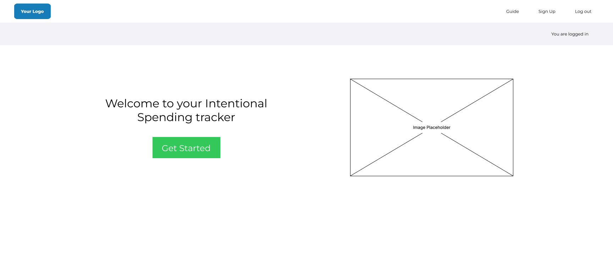

# Welcome to The 50:30:20 Budget Manager

Simplify Your Budgeting with the 50/30/20 Rule
Easily manage your finances by categorizing your expenses into three simple categories: Needs, Wants, and Savings/Debt.

link to Live site - https://budgetmanager-50-30-20-82c8070c76df.herokuapp.com/

## Problem Statement
Managing personal finances effectively can be challenging without a clear budgeting framework. Many individuals struggle to balance essential expenses, discretionary spending, and long-term savings, leading to financial stress. There is a need for a simple tool that helps users allocate their income efficiently.

## Purpose
The 50:30:20 Budget Manager app aims to provide a straightforward tool for managing personal finances using the 50:30:20 rule. It helps users allocate 50% of their income to essentials, 30% to discretionary spending, and 20% to future savings, promoting financial stability, reducing stress, and promoting intentional spending.

## Target Audience
- Young professionals
- College students
- Families
- Individuals seeking financial improvement
- Personal finance enthusiasts

## Features
- User Authentication (Registration, Log In)
- Income and Expense Tracking
- Budget Allocation (50:30:20)
- Clean, intuitive interface
- Basic Settings and Customization
- Filter by week, month, or year

## Additional Features
- Piechart Visualization
- Bar Chart for expenses
- Connection to different bank accounts

## User Stories
### User Authentication
- As a user, I want to create an account so that I can securely access my budget data.
- As a user, I want to log in so that I can access my existing budget information.
- As a user, I want to log out so that I can ensure my budget data is secure.

### Income and Expense Tracking
- As a user, I want to input my monthly income so that I can track my total available funds.
- As a user, I want to add an expense so that I can keep track of my spending.
- As a user, I want to categorize my expenses so that I can see how my spending aligns with the 50:30:20 rule.

### Budget Allocation
- As a user, I want the app to automatically allocate my income based on the 50:30:20 rule so that I can easily follow a balanced budget.
- As a user, I want to see a summary of my allocated budget so that I know how much I should spend in each category.

### Visual Budget Overview
- As a user, I want to see a pie chart of my budget allocation so that I can visually understand how my income is distributed.
- As a user, I want to see a bar chart comparing my actual expenses to my budget so that I can quickly identify overspending or underspending.

### Basic Reporting and Insights
- As a user, I want to see a monthly summary of my income and expenses so that I can review my financial activity for the month.
- As a user, I want to compare my actual spending to my budgeted amounts so that I can assess my adherence to the 50:30:20 rule.

### User Interface
- As a user, I want to input my monthly income so that I can track my total available funds.
- As a user, I want to add an expense so that I can keep track of my spending.
- As a user, I want to categorize my expenses so that I can see how my spending aligns with the 50:30:20 rule.

### Basic Settings and Customization
- As a user, I want to update my profile information so that my account details are current.
- As a user, I want to adjust my income so that my budget reflects any changes in my earnings.

## Database Structure
Basic Data Model 

Data Model (with planned/received amount, Planned/spent amount, target amount/current amount ) 

## Competitor Research
(Include your competitor research screenshots and descriptions here)

## User Flow 

## User Experience / Wireframes

Login / Sign up 

)

.png)

Desktop 

Planned tab

Spent Tab 

Remaing Tab

Mobile

Planned tab

Spent Tab 

Remaing Tab

## Agile Methodology

When developing this app an agile approach has been taken throughout this project. I adapted and agile methodology to ensure an efficient and continual progress was being made. I broke each instance down into smaller user stories so they were refined into more manageable tasks therefore each user story has different acceptance criterias. The link to the kanban board for the User Stories can be found [here](https://github.com/users/JPudsey-11/projects/4/views/1).

## Agile Methodology

By utilising the MoSCoW prioritisation method in this project I was able to categorise my tasks into:

# Must Haves

- User Authentication (Registration, Log In)
- Income and expense tracking ( Income Input, Expense Categorisation, Expense input)
- Budget Allocation (50:30:20 / Shows you the goal 50:30:20 / The actual amount (% & £) for that month.
- Clean, intuitive interface

# Should Haves

- Piechart Visualisation
- Basic Settings and customisation.

# Could Haves

- Bar Chart for expenses
- Connection to different bank accounts
- Filter by week, month or year.

## Kanban Board

The Kanban Board provided a visual overview of the project's progress and facilitated efficient task management. It was organised into the following sections:
- Todo: This section contained all the tasks that needed to be done for the project to be completed and done.
- In Progress: The in progress section indicated active tasks that were being worked on.
- Done: The done section are the tasks that were completed successfully.

## User Stories 

User stories played a vital role in the development process, it helped ensure the features were inline with the users needs, all of the user needs were written out onto the kanban project board, which helped guide tasks being implemented and what to prioritse.

## Task Management

In addition to tracking user stories, the kanban board functioned as a detailed task list. I used it to break down user stories into smaller, actionable tasks, ensuring clear and manageable objectives for development. This granular approach allowed for efficient progress tracking. By applying agile principles and effectively utilising the kanban board, the development of Penny Pinchers remained focused, adaptable, and responsive to changing requirements, resulting in a more robust and user-centered Django expense application.

Features 

## Testing
- Document manual and automated testing procedures.
- Provide details on testing results and any bugs found and fixed.

## Deployment
- Describe the deployment process step-by-step.
- Include any issues encountered and how they were resolved.

## Future Features
- Outline any features you plan to add in the future.

## Citation of Sources
- Provide citations for any code, images, or other resources used.

## Known Bugs
- List any known bugs and their impact on the application.

## Conclusion
Summarize the project and any final thoughts.

---

By following these steps and using the provided structure, you should be able to effectively organize your project and ensure that you meet all the assessment criteria. Good luck with your project!
